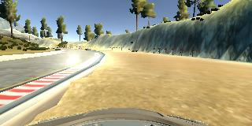

# **Behavioral Cloning** 

## Writeup 

---

**Behavioral Cloning Project**

The goals / steps of this project are the following:
* Use the simulator to collect data of good driving behavior
* Build, a convolution neural network in Keras that predicts steering angles from images
* Train and validate the model with a training and validation set
* Test that the model successfully drives around track one without leaving the road
* Summarize the results with a written report


## Rubric Points
### Here I will consider the [rubric points](https://review.udacity.com/#!/rubrics/432/view) individually and describe how I addressed each point in my implementation.  


---
### Files Submitted & Code Quality


#### 1. Submission includes all required files and can be used to run the simulator in autonomous mode

My project includes the following files:
* model.py containing the script to create and train the model
* drive.py for driving the car in autonomous mode
* model.h5 containing a trained convolution neural network 
* writeup_report.md summarizing the results

#### 2. Submission includes functional code
Using the Udacity provided simulator and my drive.py file, the car can be driven autonomously around the track by executing 
```sh
python drive.py model.h5
```


#### 3. Submission code is usable and readable

The model.py file contains the code for training and saving the convolution neural network. The file shows the pipeline I used for training and validating the model, and it contains comments to explain how the code works.


### Model Architecture and Training Strategy


#### 1. An appropriate model architecture has been employed

My model consists of a convolution neural network with 3x3 and 5x5 filter sizes and depths between 24 and 64 (model.py lines 77-81) 

The model includes RELU layers to introduce nonlinearity, and the data is normalized in the model using a Keras lambda layer (code line 69). 

#### 2. Attempts to reduce overfitting in the model

The model was trained and validated on different data sets to ensure that the model was not overfitting (code line 16). The model was tested by running it through the simulator and ensuring that the vehicle could stay on the track. I added dropout layers and used activation functions in order to decrease overfitting.(lines 84-92)

#### 3. Model parameter tuning

The model used an adam optimizer, so the learning rate was not tuned manually (model.py line 94).


#### 4. Appropriate training data

Training data was chosen to keep the vehicle driving on the road. I used a sample data provided.

### Architecture and Training Documentation


#### 1. Solution Design Approach

The overall strategy for deriving a model architecture was to was to use multilayer convolutinal network complex enough to learn hierarchy of road features sufficient to make steering predictions.

I use a convolution neural network model developed by nvidia architecture, because it was suggested in the course.

In order to gauge how well the model was working, I split my image and steering angle data into a training and validation set. I found that my first model had a low mean squared error on the training set but a high mean squared error on the validation set. This implied that the model was overfitting. 

To combat the overfitting I extendet the data by generating new samples. I mirrored the images and used images from left or right cameras at random, adjusting steering appropriately. 

The final step was to run the simulator to see how well the car was driving around track one. 

At the end of the process, the vehicle is able to drive autonomously around the track without leaving the road.


#### 2. Final Model Architecture

The final model architecture (model.py lines 73-92) consisted of a convolution neural network with the following layers and layer sizes:

* Lambda layer for preprocessing
* Cropping2D layer 
* Convolution2D with filter size 5x5, and depth 24
* Convolution2D with filter size 5x5, and depth 36
* Convolution2D with filter size 5x5, and depth 48
* Convolution2D with filter size 3x3, and depth 64
* Convolution2D with filter size 3x3, and depth 64
* Flatten layer
* Fully connected size 1164
* Dropout
* Fully connected size 100
* Dropout
* Fully connected size 50
* Dropout
* Fully connected size 10
* Dropout
* Fully connected size 1

#### 3. Creation of the Training Set & Training Process

To capture good driving behavior, I first recorded two laps on track one using center lane driving. Here is an example image of center lane driving:


I then recorded the vehicle recovering from the left side and right sides of the road back to center so that the vehicle would learn to drive toward center of the road. These images show what a recovery looks like starting from right side :




To augment the dataset, I also flipped images and angles thinking that this would be equivalent to driving on a different track. For example, here is an image that has then been flipped:


I used images from left and right camera, choosing randomly between them, in addition to central camera images,this helped to decrease the number of steering angles close to zero. Angles close to zero are very common so decreasing their frequency should improve date variability. 

After the collection process, I had 8036 data points.

I finally randomly shuffled the dataset and put 20% of the data into a validation set. 

I used this training data for training the model. The validation set helped determine if the model was over or under fitting. I trained the model for 10 epochs. I used an adam optimizer so that manually training the learning rate wasn't necessary.
